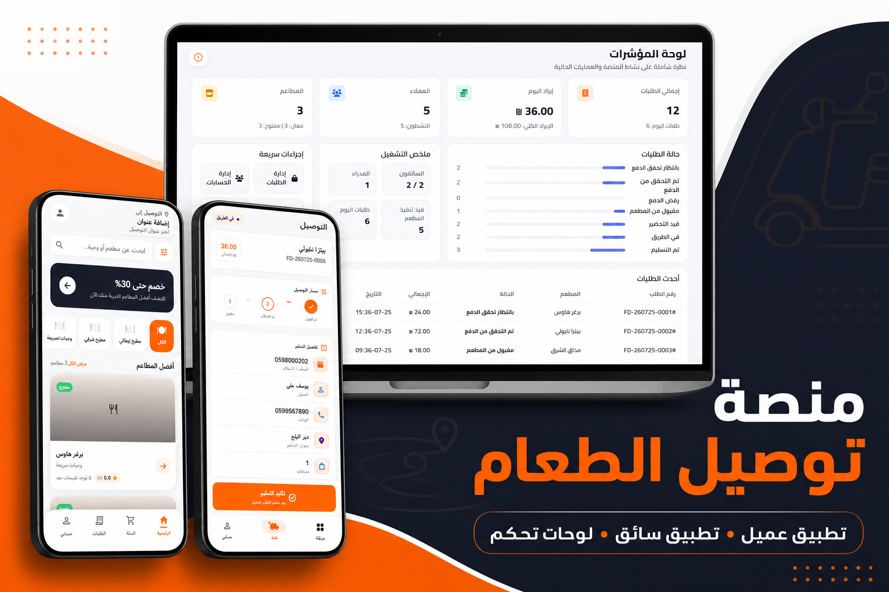
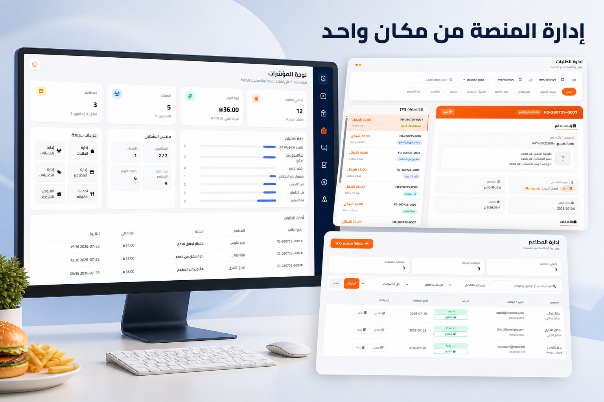
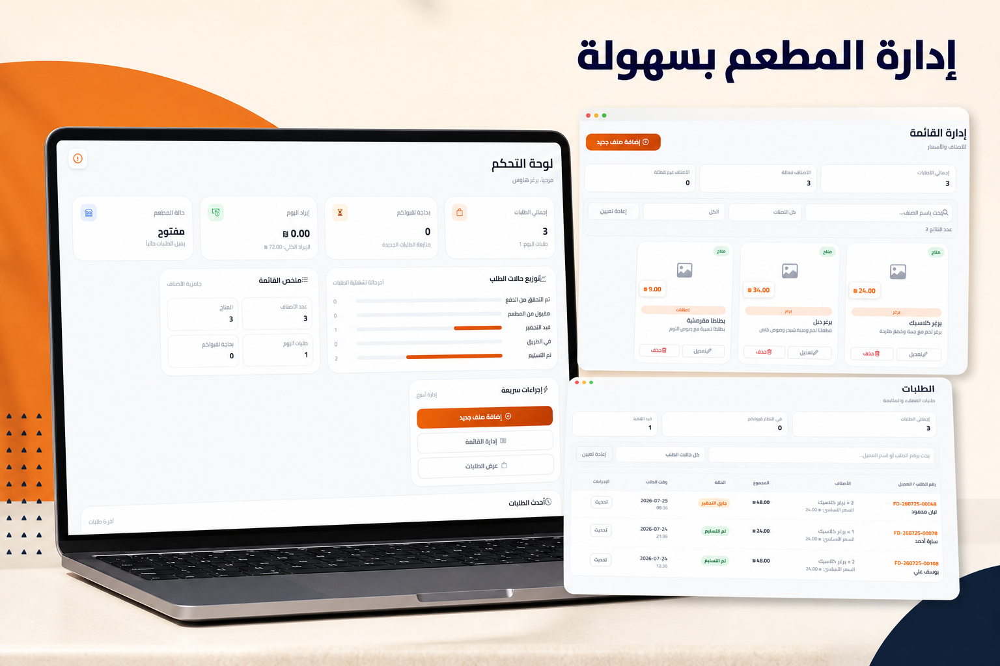
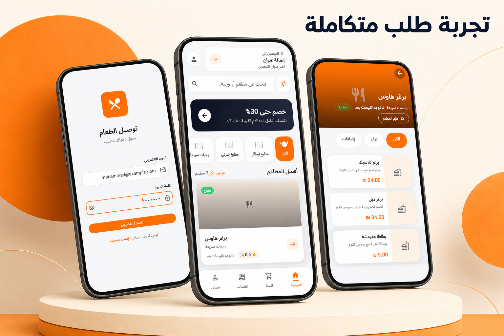
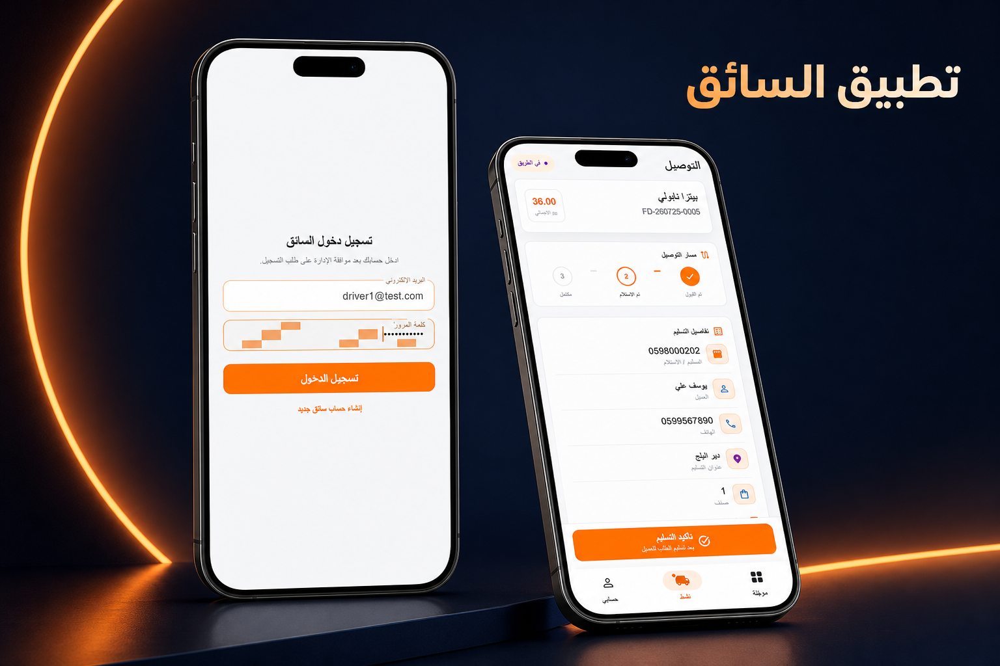

# منصة توصيل الطعام

منصة متكاملة لإدارة طلبات الطعام، تضم لوحة تحكم للإدارة وتطبيقين للعملاء والسائقين.

## مكونات المشروع

- `food-delivery/` — لوحة الإدارة والـ API باستخدام Laravel.
- `customer_app/` — تطبيق العميل باستخدام Flutter.
- `driver_app/` — تطبيق السائق باستخدام Flutter.

## معرض الواجهات

### نظرة عامة على المنصة

### لوحة الإدارة

### تطبيق العميل

### تطبيق السائق

